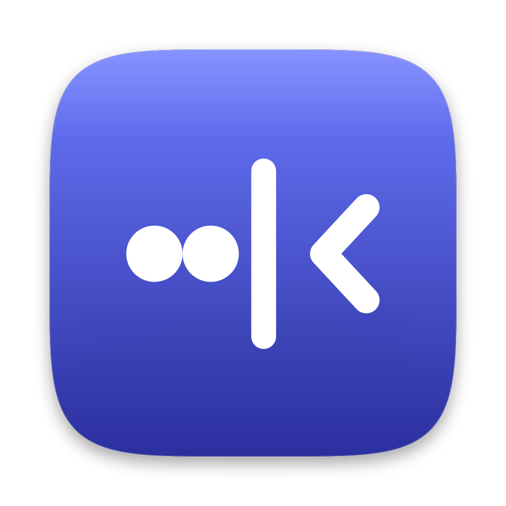
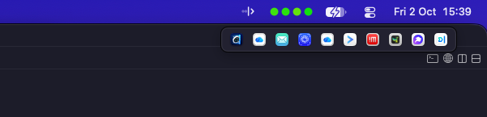

<div align="center">



# SmartHiddenBar

### Hide the menu bar clutter. Reach it in one click.

A small native **macOS 27** menu-bar app that hides every menu-bar item to the left of its icon,
shows them again in a tidy icon bar on demand, and lets you use a hidden item's menu **without unhiding anything**.

[](https://www.apple.com/macos/)
[](https://swift.org)
[](LICENSE)
[](https://github.com/roypadina/SmartHiddenBar/stargazers)

<br>



<sub><i>The icon bar: everything currently off the menu bar, one click from its menu.</i></sub>

</div>

---

## Features

- **One-click hiding.** Move the SmartHiddenBar icon (⌘-drag) and every item to its left hides. Click it (or press your own shortcut, set in Settings) to hide or show them.
- **Icon bar.** Everything currently off the bar, as a row of icons under SmartHiddenBar's icon: ⌥-click, double-click, or a keyboard shortcut (⌃⌥B by default, recordable in Settings).
- **Right-click menu.** Show/Hide items, an **Apps** submenu listing every third-party menu bar app (icon + name), Settings… and Quit. Each has its own recordable shortcut.
- **Menu mirroring.** Pick a hidden item and use its menu from under SmartHiddenBar's icon, without unhiding it.
- **Real menu bar icons (optional).** With Screen Recording, the icon bar shows each item's actual menu-bar icon instead of the app icon.
- **Auto-rehide** after 5 / 10 / 30 / 60 s, and **launch at login**.

## Install

> **Requires macOS 27.** It will not work on earlier versions (see [Limitations](#limitations)).

```bash
brew install --cask roypadina/tap/smarthiddenbar
```

**Not notarized.** SmartHiddenBar is ad-hoc signed, so macOS may block the first launch. Either
right-click it in `/Applications` → **Open** (then **Open Anyway** in System Settings → Privacy & Security),
or clear quarantine once:

```bash
xattr -dr com.apple.quarantine "/Applications/SmartHiddenBar.app"
```

### Required setup

- **Run it from `/Applications`.** On macOS 27, MenuBarAgent resolves the allow-listed app through
  LaunchServices, which picks the `/Applications` copy; a copy anywhere else gets hidden along with the rest, so the app quits with a message.
- **Accessibility (required).** It reads other apps' menu bar items through the Accessibility API. **After every update you must re-grant it** (the ad-hoc signature changes with each build): toggle SmartHiddenBar off and on in System Settings → Privacy & Security → Accessibility, or reset and grant again:
  ```bash
  tccutil reset Accessibility com.roypadina.SmartHiddenBar
  ```
- **Screen Recording (optional).** Only for "Real menu bar icons" in Settings. macOS asks about once a month whether to keep allowing it.

On first run, ⌘-drag the SmartHiddenBar icon to the right of the items you want hidden.

## Usage

| Action | Result |
|---|---|
| Click, or the show/hide shortcut (off by default) | Hide / show everything left of the icon |
| ⌥-click, double-click, or the icon-bar shortcut (⌃⌥B default) | Icon bar with every item currently off the bar |
| Click an icon in the icon bar | That item's menu, under SmartHiddenBar's icon |
| Right-click (or ⌃-click) | Show/Hide items · Apps ▸ (every third-party menu bar app; pick one to use its menu) · Settings… · Quit |

Settings: launch at login, auto-rehide, five recordable shortcuts (show/hide items, icon bar, list apps, settings, quit; all off by default except the icon bar: click the shortcut, press a combo with ⌃, ⌥ or ⌘; Esc cancels, Delete or Off clears), app icons vs. real menu bar icons, names in the icon bar, and permission status.

## How it works

macOS 27's `MenuBarAgent` has a private "assessment mode" allow-list (`MenuBarClientCore`): while a
process holds it, the bar shows only the allowed apps plus system items. SmartHiddenBar allows
itself, the system items, and every app whose item sits to the right of its icon; apps left of the icon are denied. Hiding is
therefore **per app, not per item**. Nothing is moved or modified: quitting SmartHiddenBar
(or "Show items") releases the allow-list and the full bar comes back. Item lists and menus are read, and
menu items pressed, through the Accessibility API (`AXExtrasMenuBar`). Mirroring copies the real menu, closes it, and replays your pick on the real one.

## Limitations

- **macOS 27 only.** It relies on a **private API** that Apple can change or remove in any update; if it is missing, SmartHiddenBar tells you and leaves everything visible.
- Hiding is **per app**: an app with several items hides or shows them together.
- **Apple's own items** (Control Center, Wi-Fi, clock, ...) can't be hidden.
- Only items **left of SmartHiddenBar's icon** are hidden.
- Mirrored menus are a snapshot: titles that change while the menu is open may be stale.

## Privacy

No network access, no analytics. It writes a small log to `~/Library/Logs/SmartHiddenBar.log`
(hide decisions and errors, no personal data) and preferences to the defaults domain `com.roypadina.SmartHiddenBar`.

## Build from source

```bash
git clone https://github.com/roypadina/SmartHiddenBar.git
cd SmartHiddenBar
./build.sh   # builds and installs /Applications/SmartHiddenBar.app (quit a running copy first)
```

`RELEASE=1 ./build.sh` makes an ad-hoc `build/SmartHiddenBar.zip` without installing. See [CONTRIBUTING.md](CONTRIBUTING.md).

## Uninstall

```bash
brew uninstall --zap --cask smarthiddenbar
```

Or quit it, drag `/Applications/SmartHiddenBar.app` to the Trash, and remove it from Login Items.

## Credits

The hiding approach and the private-API shim pattern come from [Hidden Bar](https://github.com/dwarvesf/hidden)
by Dwarves Foundation (MIT); see [LICENSE](LICENSE) for its notice.

## Support

If SmartHiddenBar tidies your menu bar, you can [**buy me a coffee on Ko-fi ☕**](https://ko-fi.com/roypadina) — optional, always appreciated. A **⭐ star** helps just as much.

## License

[MIT](LICENSE) © Roy Padina
